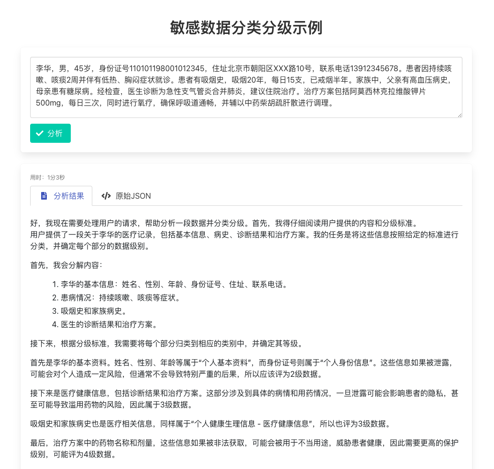
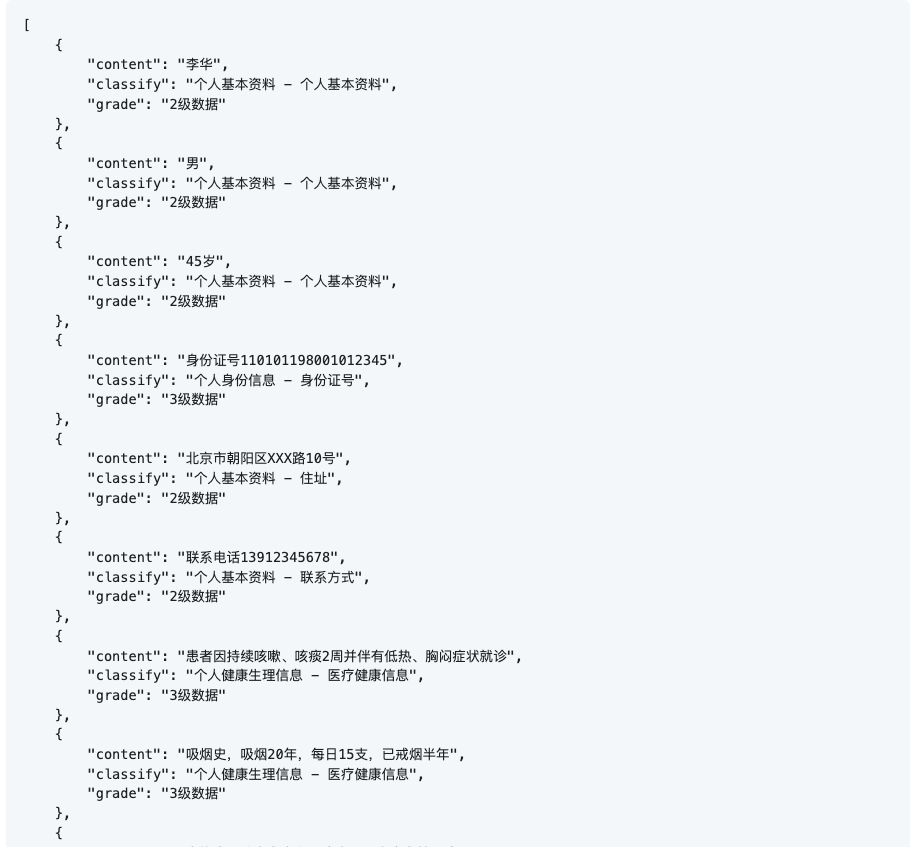
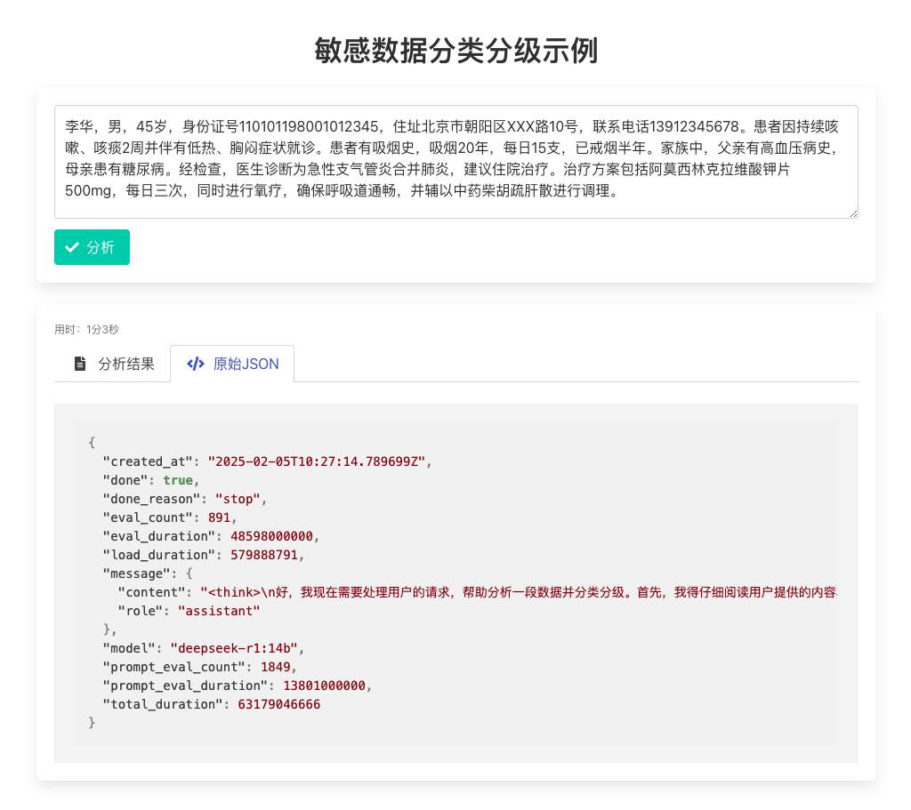
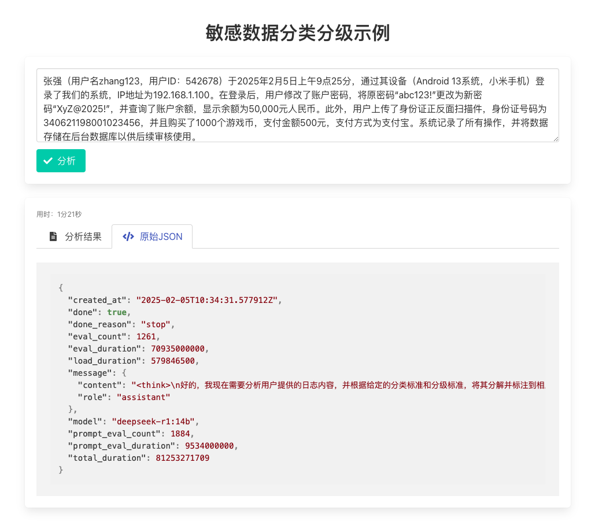
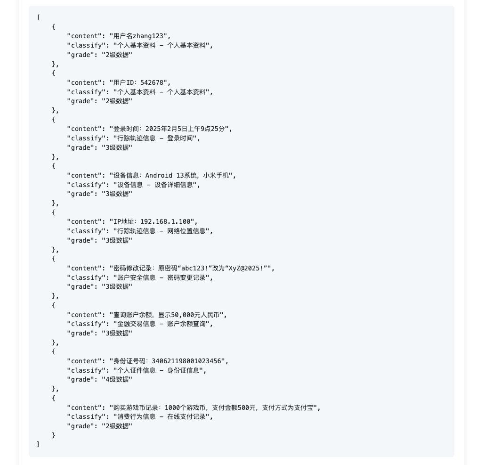

## 如何运行？

```sh
# 下载 ollama deepseek-r1
ollama run deepseek-r1:14b

# 安装依赖
python3 -m venv aienv
source aienv/bin/activate
pip install flask requests
 
# 启动 http 服务
python ollama_deepseek.py
```

正常的话，服务已经运行 `http://127.0.0.1:5000`，通过浏览器访问，测试数据请参考 `./tests/sensitive_data.txt`。


## 基于LLM分类分级是什么？

基于大模型的数据分类分级技术与传统的分词、正则表达式等方法在处理数据分类和分级时有显著的区别。

### 1. **语义理解的深度**
   - **大模型（如 GPT、BERT 等）**：大模型基于深度学习，能够捕捉语句的上下文、长程依赖以及复杂的语义关系。它们通过预训练来学习大量文本中的模式，从而能够理解文本的深层含义，不仅仅是词汇层面的匹配。
   - **传统方法（分词、正则表达式等）**：传统方法通常依赖于手动定义规则，如关键词匹配、正则表达式等。这些方法对于短文本和明确模式的分类可能有效，但对于复杂、含糊或上下文丰富的文本，它们往往难以正确理解和分类。

### 2. **特征提取方式**
   - **大模型**：不需要显式的特征提取，模型通过自我学习能够从原始文本中自动提取出高效的特征。大模型的表示能力极强，能够将词汇、句子甚至段落的含义映射为高维向量，进行深度的分类或分级。
   - **传统方法**：传统方法依赖人工设计的特征提取方式（如分词、词频统计、正则表达式匹配等），这些特征通常是浅层的，可能无法有效捕捉文本的隐含信息。

### 3. **适应性与灵活性**
   - **大模型**：大模型能够在多种数据和任务上进行微调，适应不同的文本类型和分类标准。由于其强大的上下文理解能力，它能够处理各种复杂情境，如同义词、语法变化等，并且具有很强的泛化能力。
   - **传统方法**：传统方法的适应性较差，往往依赖于预定义的规则或模式。如果数据的模式发生变化或包含新的类型信息，可能需要重新设计或调整规则。这种方法在处理变化快速或数据量大的情况时，效率较低。

### 4. **处理能力与规模**
   - **大模型**：大模型能够处理海量数据，且在大规模数据集上表现更好。由于其预训练的特性，可以快速适应新的领域或任务，适合复杂和大规模的分类分级任务。
   - **传统方法**：传统方法处理大规模数据时通常需要大量的人工干预，且难以扩展到新的领域或任务，尤其是在需要考虑复杂上下文或长文本时，性能可能急剧下降。

### 5. **错误容忍度和鲁棒性**
   - **大模型**：大模型在面对不完全准确或不规范的数据时，依然能够保持较高的容错性，因为它能够根据上下文推理出正确的分类。对于拼写错误、语法不规范或词语替换等，模型具有一定的容错能力。
   - **传统方法**：传统方法的错误容忍度较低，尤其是在处理不符合预定规则的数据时，容易出现漏判或误判的情况。正则表达式等方法对于一些意外或不规范的输入可能无法正确处理。

### 6. **实时性和计算资源**
   - **大模型**：虽然大模型在精度和灵活性方面表现出色，但它们通常需要大量计算资源，尤其在推理阶段。运行大规模模型时需要强大的硬件支持，如 GPU、TPU 等。
   - **传统方法**：传统的分词和正则表达式方法计算资源消耗较小，通常可以快速响应，适用于资源受限或需要高响应速度的场景。

### 总结：
大模型相比于传统的分类分级技术，在处理复杂、含糊的文本数据时具有明显优势。它们通过深度学习自动提取高维特征，能够理解文本的深层语义，适应性强，并且能处理大规模的数据。然而，这也需要强大的计算能力支持。相比之下，传统方法依赖于手动规则和特征设计，虽然计算资源消耗较少，但在面对复杂情境时的表现通常较差。

根据具体的应用场景，选择合适的方法是很重要的。如果数据较为简单且规则明确，传统方法可能更高效；而对于复杂、多变的任务，基于大模型的方法则能提供更高的准确性和灵活性。

## 运行示例：

**1. 模拟包含敏感数据的病历数据**


**2. 分类分级的结果（JSON 格式）**


**3. Ollama 元数据**


**4. 模拟包含敏感数据的日志信息**


**5. 分类分级结果**
